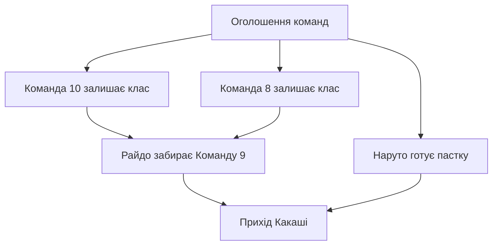

# Хронологія Naruto: сцени, події, присутність і редагування

**Проєкт рішення · 25 вересня 2026 · для розвитку поточного v10**

## Рішення в одному абзаці

Зберігати **події з незмінними ID, зв’язки часу між ними та проміжки присутності персонажів**. Об’єднувати їх у сцени з визначеним місцем. Дати прив’язувати через окремі опори, які можна пересувати. Персональні шкали, командні шкали й календар будувати з цих спільних даних. Тоді зміна дати не руйнує послідовність, додавання розмови не вимагає переписувати весь день, а персонаж на задньому плані залишається в історії.

Для звичайної правки користувач заповнює: **що відбулося; де; коли або між чим; хто діє; хто ще присутній; звідки це відомо**. Решту — ID, посилання, обчислені списки й перевірки — веде редактор.

Найважливіші рішення:

- Одна реальна подія має один запис і може з’являтися на багатьох шкалах.
- Одна сцена містить кілька подій; її склад змінюється через входи й виходи.
- Відомий порядок, доведене одночасне перебігання й невідомий порядок — три різні випадки.
- `100 / 200 / 300` залишаються зручними номерами показу. Хронологічну істину зберігають зв’язки й часові обмеження.
- Фізична присутність, активна участь, згадка й погляд оповідача зберігаються окремо.
- Кожна подія має один `Origin`; додаткова присутність із твоєї історії має власну підставу й не змінює походження самої події.
- Початкові тексти, попередні версії та відповідність старим ID зберігаються під час усіх перетворень.

Цей документ описує майбутню реалізацію. Він не означає, що дані v10 уже перенесені або сайт уже має перелічені перевірки.

## 1. На чому ґрунтується рішення

Перевірено репозиторій `DSMykyta/Konoha-Gaiden-Chronicles`, стан `main` на коміті `1b8881ab5a67d1feb6fa8e170c9c4f6a5bb9e950`:

- `CHRONOLOGY/Naruto_Timeline_Year_0_v10.tsv`: 346 записів, 346 унікальних ID, 151 дата.
- `CHRONOLOGY/V10_SCHEMA.md`: 21 колонка; є `Order`, але ще немає окремої моделі присутності та часових відношень.
- Початкова сцена `GAMES/TEAM_9/ARCS/arc 01 [Розподіл і крамниця данго].txt`.
- Уточнення користувача в наданому обговоренні: єдина хронологія, крок 100, один `Origin`, фонові персонажі, спільна сцена Команд 7 і 9.

Це дало конкретні вимоги до нової моделі:

| Приклад у поточному v10 | Що повинна розрізняти система |
|---|---|
| `V10-000009-B`: Какаші є в `Characters`, коли Райдо забирає Дев’яту | Членство в Команді 7 не дорівнює присутності Какаші в класі |
| Той самий запис переказує звернення Райдо неточно; у літературній сцені він питає «Дев’ята?», Сакура відповідає «Сьома» | Посилання на конкретний фрагмент джерела й активна участь Сакури |
| `V10-000222-B`: Саске включено в розмову Кіби із Шіно про нього | Згаданий персонаж не стає фізично присутнім |
| `V10-000222-C`: у списку є згаданий Наруто, але немає Хіаші, який тренується з Неджі | Витягування імен із тексту не замінює розмітку участі |
| `V10-000006`: розподіл, підміна Саске, розмова й знайомство з Какаші зібрані в один рядок | Межі окремих подій, сцени та переміщення |
| Для класу в цьому записі вказана `Land of Waves` | Назва арки не визначає місце події |
| 24.09 різні бої мають наскрізні номери `100…1500` | Порядок рядків сам по собі не доводить послідовність усіх боїв |

Це приклади для проєктування, а не повний фактологічний аудит року. Порожній `Review` у старому файлі не засвідчує перевіреність кожного поля.

## 2. Що саме зберігаємо

| Об’єкт | Призначення | Приклад |
|---|---|---|
| **Сутність** | Стабільна особа, тварина, команда, організація або місце | Наруто; Акамару; Команда 8; конкретна аудиторія |
| **Сцена** | Просторово й часово окреслений фрагмент історії | Очікування наставників у класі |
| **Подія** | Окрема змістовна дія або зміна стану | Райдо звертається до Сакури; Дев’ята виходить |
| **Присутність** | Хто фізично перебуває в сцені та між якими межами | Сакура — від початку очікування до виходу Сьомої |
| **Опора дати** | Розміщення пов’язаного фрагмента на календарі | День розподілу команд зараз стоїть на 22.01 року 0 |
| **Часовий зв’язок** | Відоме відношення подій або їхніх меж | Вихід Дев’ятої передує приходу Какаші |
| **Джерело / підстава** | Звідки взято конкретну інформацію | Глава; кадр епізоду; фрагмент арки; рішення користувача |

Окремі історії Наруто, Кіти, Команди 8 чи Райдо не отримують копій тієї самої події. Вони є вибірками з однієї бази.

### Межа сцени

Сцена має достатньо конкретне місце, щоб можна було говорити про спільну присутність. «Клас Академії» підходить; «Коноха» для всіх подій дня — надто широко.

Одночасний епізод під вікнами Академії є іншою сценою. Кіта може бачити трьох джонінів унизу, але вони не входять до складу аудиторії. Спостереження між сценами оформлюється окремим зв’язком.

Переїзд, часовий стрибок або перехід до іншого місця зазвичай починає нову сцену. Арка об’єднує такі сцени, але не переносить їхній склад одна в одну.

### Межа події

Ділимо там, де важливо окремо показати зміну складу, місця, стану, знання, джерела або часову залежність. Розмова може залишатися однією подією, якщо її не потрібно розміщувати й фільтрувати частинами.

Не встановлюємо ліміт символів як критерій атомарності. Короткий рядок може містити три різні сцени; довга розмова може бути однією цілісною подією. Жест, поворот голови чи кожна репліка не потребують власного вузла автоматично.

## 3. Час: частковий порядок замість вигаданої черги

Кожна сцена й кожна подія мають початок і кінець. Це стабільні адресовані межі: `event-id.start`, `event-id.end`. Вони можуть існувати без відомої години. Для справді миттєвої події початок збігається з кінцем; невідома тривалість розмови не перетворює її на мить.

### Мінімальні часові відношення

| Відношення | Значення |
|---|---|
| `before(A, B)` | A завершилася раніше, ніж почалася B: `A.end < B.start` |
| `meets(A, B)` | Кінець A є початком B: `A.end = B.start`; тільки за наявності підстави |
| `within(A, S)` | A повністю міститься в S, включно з можливим збігом меж |
| `intersects(A, B)` | Події мають спільний ненульовий проміжок часу |
| `same_span(A, B)` | Обидві межі збігаються; це сильніше, ніж часткове перекриття |
| Порівняння меж | Наприклад, `A.start < B.start`, коли відомо лише, що A почалася раніше |

`intersects` тут означає будь-яке перекриття інтервалів, включно з вкладенням. Це власний термін проєкту, а не буквальний аналог вузького `intervalOverlaps` з OWL-Time. Для миттєвих подій використовуємо рівність або входження межі в інтервал.

**Одна дата не доводить одночасності. Відсутній зв’язок порядку теж не доводить одночасності.**

Якщо Асума й Куренай забрали свої команди після оголошення, а до Райдо обидві команди вже пішли, зберігаємо чотири зв’язки: оголошення перед кожним виходом; кожний вихід перед приходом Райдо. Зв’язку між виходами Команд 8 і 10 не додаємо, доки його не встановлено.

Не створюємо окремого часового факту `unordered`: це відсутність установленого взаємного порядку. Позначка перевірки дозволяє розрізнити «перевірено, порядок лишається невідомим» і «ще не перевіряли».

### Чому однаковий `Order` не розв’язує проблему

Один слот `300` змішує невідомий порядок з одночасністю. Крім того, відсутність порядку не є транзитивною: порядок A–B може бути невідомий, B–C теж невідомий, але A точно передує C. Об’єднання всіх трьох в один «невпорядкований блок» втратить цю інформацію.

Тому основою є **граф відомих обмежень**, а таблиця — один зі способів його показу. Система зберігає всі допустимі варіанти, а не обирає один і не записує його як встановлену історію.

### Що робимо із сотнями

Залишаємо одне поле `display_rank`: `100 / 200 / 300`, вставки `250 / 275`. Воно допомагає стабільно розташувати картки, коли час не задає єдиного порядку.

- Часові зв’язки завжди мають пріоритет над `display_rank`.
- Вставка між картками не створює зв’язок «після / перед», доки це не є змістом операції.
- Коли цілі числа між сусідами закінчилися, редактор перенумеровує лише локальний блок показу.
- ID, дати, джерела та часові зв’язки при цьому незмінні.
- Однакові ранги допустимі; остаточний технічний вибір робиться за стабільним ID й не набуває історичного значення.
- Нумерація не кодує хвилини й не визначає довжину події.

Поля `Order` і `Sort` одночасно не потрібні. Старий `Order` зберігається в імпорті й може стати початковим `display_rank`, але не автоматично набором `before`.

## 4. Дати, невизначеність і перенесення

### Дата має окрему опору

Сцени розподілу, очікування та знайомства можуть посилатися на одну опору `ta-team-formation`. Її календарне значення зараз — `{year: 0, month: 1, day: 22}`.

Якщо дата всього цього дня уточниться, змінюється одна опора. Усі явно прив’язані сцени пересуваються разом. Часові зв’язки та проміжки присутності залишаються на тих самих ID.

**Опора об’єднує лише події, які свідомо прив’язали до спільного дня історії.** Дві незалежні сцени, що випадково стоять на 22.01, не повинні автоматично мати одну рухому опору.

Наступний день можна задати як посилання на ту саму опору з `day_offset: 1`, якщо зв’язок «наступного дня» встановлений. Посилання «після» без зазначеної тривалості не означає «наступного дня».

### Чотири різні часові випадки

| Відомо | Зберігаємо | Показуємо |
|---|---|---|
| Подія в певний день, година невідома | Прив’язку до дня; без годин і без добової тривалості | Вузол у межах дня |
| Подія почалася 21-го й закінчилася 23-го | Межі реальної тривалості | Суцільну смугу через кілька днів |
| Подія сталася в якийсь момент між 21-м і 23-м | Вікно можливого розміщення, окремо від тривалості | Позначене невизначене вікно |
| Відомо лише «після X, перед Y» | Часові зв’язки; дата може залишитися порожньою | Подію між опорами або в розділі подій без установленої дати |

Вікно можливого розміщення не означає, що подія тривала весь цей час. Якщо вікна двох подій перетинаються, це лише допускає одночасність.

Для кожної календарної прив’язки окремо фіксуємо:

- **точність:** день, місяць, година тощо;
- **характер розміщення:** установлена дата, приблизне вікно або робоча дата;
- **підставу:** джерело, рішення проєкту, висновок, імпорт;
- **стан перевірки** й коротке пояснення, якщо дата виведена.

Дату 22.01, успадковану з v9, не оголошуємо прямо названою в манзі. Робочу дату можна використовувати для зручного показу, але валідатор не повинен вважати її сильнішим фактом за перевірений зв’язок подій.

### Частини дня

`DayPart` лишається окремим полем. Ранок, полудень, вечір не потребують вигаданих годин. `unknown` означає невідоме значення; перевіреність цього поля ведеться окремо.

Для ночі уточнюємо, коли це потрібно: перед світанком, після сутінків або невизначена частина ночі. Не сортуємо будь-яке `night` автоматично після вечора тієї самої календарної дати.

Точний час, наприклад `14:32`, має власне джерело. Перехід через північ змінює календарний день; назва «ніч після іспиту» може лишатися назвою сцени.

### Календар проєкту

Рік 0 — внутрішній рік хронології. Зберігаємо числа року, місяця та дня, включно з від’ємними роками, якщо вони знадобляться. Не перетворюємо їх на земні UTC-дати й не застосовуємо часовий пояс Києва.

Правила довжини місяців і високосних років задаються один раз у конфігурації календаря. Для року 0 зберігаємо чинну 365-денну сітку. Правила інших років є технічною домовленістю проєкту й не видаються за встановлений факт світу Naruto. Сайт сам створює порожні календарні дні: для них не потрібні фіктивні події.

## 5. Присутність: персонаж не зникає, коли камера дивиться на іншого

### Проміжок замість повторення списку в кожному рядку

Запис присутності має:

`presence_id · entity_id · scene_id · from · to · mode · evidence · review`

Наприклад: Сакура фізично присутня від початку очікування до виходу Команди 7. Усередині цього проміжку редактор автоматично свяже її з подіями цієї сцени, навіть якщо конкретна подія зосереджена на Кіті.

Межі посилаються на ID, а не на номер `300` або позицію рядка. Застосовуємо інтервал `[from, to)`: персонаж присутній під час власного виходу, але після завершення виходу вже не належить до складу класу.

Повернення створює новий проміжок присутності того самого персонажа. Воно не розтягує попередній проміжок через час його відсутності.

### Коли присутність підтверджена, а коли лише можлива

Умова входження події в присутність визначається часовими зв’язками, а не тим, що її рядок стоїть між двома іншими.

- Якщо в усіх допустимих розміщеннях подія повністю міститься в проміжку присутності — присутність на цій події встановлена.
- Якщо перетин доведений лише для частини події — показуємо часткову присутність або виділяємо змістовну межу.
- Якщо перетин лише можливий — позначаємо можливу присутність; у точну кількість людей її не додаємо.
- Якщо подія точно поза проміжком — персонаж у її фізичний склад не входить.

Якщо персонажа видно на початку безперервної сцени й його виходу немає, продовження присутності може бути обґрунтованим висновком. Такий запис отримує підставу `inference`. Монтажний розрив, перехід в інше місце або часовий стрибок автоматичного продовження не дає.

Відсутність запису про персонажа означає **«присутність не встановлена»**, а не доведену відсутність. Незавершений облік позначається на сцені як `presence_coverage: partial`; повний перевірений склад — `complete`. Навіть `complete` стосується зазначеного відрізка, а не всього дня.

### Чотири різні питання

| Питання | Як відповідає модель |
|---|---|
| Хто фізично тут? | Проміжки присутності |
| Хто діє або є центром конкретної події? | `involvement` цієї події |
| Кого згадують або кого подія зачіпає заочно? | Ролі `mentioned` / `affected`, без автоматичної фізичної присутності |
| Через чиє сприйняття це розказано? | Погляд у конкретному викладі джерела — `portrayals`, незалежно від складу сцени |

Наруто може бути присутнім і мовчати. Сакура може бути активною учасницею короткого обміну з Райдо. Кіта може бути оповідачем. Це сумісні характеристики однієї сцени.

**Присутній не означає «побачив», «почув» або «зрозумів».** Для важливих відомостей про обізнаність потрібна окрема подія сприйняття чи здобуття знання. Прихований спостерігач, сплячий персонаж і людина за перегородкою не отримують знання автоматично.

### Команди й організації

Членство має власний проміжок дії та роль: учень, наставник, тимчасовий учасник. Воно допомагає побудувати командну шкалу, але не створює фізичну присутність.

Для сцени обчислюється представництво команди: наприклад, «Команда 7: троє учнів; Какаші не включений до присутніх». Дія щодо команди окремо позначається в `focus_teams`.

Присутність одного члена АНБУ не означає присутності всіх АНБУ. Присутність Команди 8 не додає Акамару без підстави: тварини й призови мають власні сутності.

До оголошення складу діти ще не є учасниками щойно сформованих команд у історичному сенсі. Для зручного перегляду можна мати режим «майбутні члени Команди 8», але він має бути явно названий ретроспективним групуванням.

### Епізодичні, безіменні та приховані особи

Кожний розпізнаний персонаж може отримати ID незалежно від кількості появ. Для конкретного безіменного учня зберігаємо тимчасову особу й опис зовнішності. Якщо пізніше встановлено ім’я, додаємо ім’я до того самого ID.

Якщо доведено, що два тимчасові ID позначають одну людину, об’єднуємо через перенаправлення старого ID. Подібність зачіски сама по собі не є підставою для злиття.

Нерозрізнений натовп зберігається колективною сутністю з відомою або невідомою кількістю. Система не вигадує окремих людей. Відомі особи, уже включені до кількості натовпу, не рахуються вдруге; для цього в колективі фіксується, чи число включає ідентифікованих учасників.

Для клонів розрізняємо фізичне втілення і персонажа-власника. Для перевтілення розрізняємо особу та видиму подобу. Це дозволяє показати лінію Наруто й не оголосити його клон у сусідньому місці помилкою. Сон або гендзюцу позначаються окремою рамкою зображення, а не фізичним переміщенням.

## 6. Джерело події й джерело окремої деталі

Зберігаємо домовленість: **одна історична подія — один `Origin`**.

| Код | Значення |
|---|---|
| M | Манґова подія |
| A | Новий матеріал аніме, прийнятий у спільну лінію |
| F | Філер |
| R | Унікальна інформація пізньої ретроспективи; повтор уже відомого матеріалу не створює R |
| G | Гра |
| O | OVA / special |
| V | Фільм |
| N | Роман |
| P | Подія твоєї історії / гри |
| D | Датабук або офіційний довідник |

Манґова подія лишається M під час екранізації й повтору у флешбеку. Нову самостійну дію з аніме або твоєї історії можна виділити окремою подією. Повторний виклад тієї самої дії стає додатковим джерелом.

Проте **походження події не доводить походження кожного її атрибута**. Якщо оголошення команд походить із манґи, а перебування Кіти в тій самій аудиторії встановлене твоєю історією, маємо:

- подію оголошення з `Origin: M`;
- окремий запис присутності Кіти з посиланням на P;
- нове оголошення саме Команди 9 як P-подію всередині цієї сцени;
- фонових однокласників, установлених за аніме, з підставою на рівні їхньої присутності.

Не потрібно ані перефарбовувати манґову подію в P, ані створювати друге оголошення всіх команд. Картка може написати: «Подія: манґа. Присутність Кіти: історія Команди 9».

### Як записується підстава

Подія, присутність, членство, місце й часовий зв’язок мають посилання на відповідні докази. Використовуємо спільні поля:

| Поле | Зміст |
|---|---|
| `evidence_ids` | Конкретні фрагменти джерел |
| `basis` | `source` / `project_decision` / `inference` / `imported` |
| `reason` | Коротке обґрунтування висновку або редакційного рішення |
| `review` | `pending` / `accepted` / `conflicted` |

Доказ містить ID джерела та локатор: главу й сторінку, епізод і перевірений таймкод, або файл, коміт і фрагмент. Якщо точний локатор ще не знайдений, це фіксується чесно. Не вигадуємо номер кадру чи сторінки.

Для файлів репозиторію зберігаємо шлях, ревізію та стійкий орієнтир фрагмента; одного номера рядка без ревізії недостатньо. Уточнення користувача можна зберегти окремою нотаткою-рішенням із датою й змістом, якщо доступного постійного посилання на повідомлення немає.

Зміна джерела має знаходити всі залежні твердження й повертати їх на перевірку. Старі твердження зберігаються в історії, а не безслідно зникають.

### Історичний час і час оповіді

Історична подія стоїть там, де відбулася. Місце її показу в манзі, аніме чи рольовому тексті зберігається в джерелі. Спогад персонажа сьогодні й згадана ним подія в минулому можуть бути двома різними вузлами, зв’язаними `recalls`.

Реальний час внесення правки — третя окрема шкала: він потрібний для історії редагувань і не впливає на дату події у світі.

`Origin`, історична дата, стан перевірки та належність до основної лінії не підміняють один одного. Подія P може мати точну дату; M — приблизну. Основна лінія проєкту містить прийняті події різного походження. Альтернативні версії мають окремий `continuity_id`; несумісні версії не активуються разом непомітно.

## 7. Як це працює на сцені Академії

### Склад сцени в різні моменти

Нижче — контрольна модель за обговоренням і прочитаним початком арки. Початкове число 13 — заданий користувачем варіант складу; перед остаточною міграцією кожна присутність отримує свою підставу. Це не твердження, що в усіх кадрах першого епізоду аудиторії рівно 13 людей.

| Момент | Фізично присутні | Хто в центрі події |
|---|---|---|
| Оголошення в класі | Наруто, Саске, Сакура; Хіната, Кіба, Шіно; Іно, Шикамару, Чоджі; Кіта, Рен, Сора; Ірука — 13 осіб у цьому прикладі | Ірука й та трійка, яку зараз називають |
| Райдо питає Сакуру «Дев’ята?» | Наруто, Саске, Сакура, Кіта, Рен, Сора, Райдо — 7 | Райдо й Сакура; відповідь Дев’ятої можна включити до цього вузла або виділити за потребою |
| Райдо веде Дев’яту до виходу | Ті самі 7 протягом виходу | Райдо, Кіта, Рен, Сора |
| Вихід Дев’ятої завершився | Наруто, Саске, Сакура — 3 | Залежить від наступної події |
| Какаші з’являється в класі | Наруто, Саске, Сакура, Какаші — 4 | Какаші й Команда 7 |

Сакура записується один раз. Акамару не додається тільки тому, що присутній Кіба. Учні Команд 8 і 10 зберігаються в ранніх фазах аудиторії, але після їхнього виходу більше не успадковують нові події цього класу.

Межу присутності Іруки треба встановити окремо. Його присутність під час оголошення не дозволяє автоматично протягнути його до приходу Какаші.

### Відомі залежності

Ця схема показує порядок, а не доведену одночасність гілок. Події «вихід Восьмої» та «вихід Десятої» можуть бути відновленими з контексту переходами, навіть якщо їх не показано окремим кадром.



Тут не стверджується порядок між B і C. Також не встановлено порядок між пасткою й приходом Райдо: прочитаний фрагмент арки його не розв’язує. Якщо звірення сцени або рішення проєкту встановить, що пастка з’явилася після виходу Дев’ятої, додаємо один зв’язок `before(D, E)`. Перенумеровувати ID й переписувати події не треба.

Наявність іншої, ще не включеної до цієї демонстрації канонічної сцени — наприклад, перерви та підміни Саске — не означає її вилучення. Під час міграції весь початковий блок розкладається зі збереженням змісту; схема вище демонструє тільки потрібні відношення.

### Паралельні сцени після виходу

Дев’ята може вже прямувати до данґо, поки Сьома ще перебуває в Академії. Для цього потрібні дві сцени, різні склади й власні події.

Якщо встановлено лише, що обидві сцени сталися того самого дня після виходу Дев’ятої, зберігаємо саме це. Якщо встановлено перекриття — додаємо `intersects`. Не прив’язуємо кожну репліку за данґо до конкретної репліки на даху без підстави.

Одна й та сама кімната в різний час також може мати кілька сцен. Список усіх людей, які будь-коли були в кімнаті, не стає складом кожної з них.

## 8. Мінімальний контракт даних

### ID

Наявні `V10-000009-B` та інші ID зберігаються. Суфікс `-B` уже є частиною ідентифікатора й більше не означає «другий за часом».

Нові ID генеруються незалежно від дати, імені й порядку, наприклад UUID. Легкі для читання короткі ID нижче використані лише для прикладу. URL події спирається на ID; назву можна змінювати вільно.

### Основні поля

| Запис | Обов’язкове ядро | За потребою |
|---|---|---|
| Сутність | `id`, `kind`, `name` | Псевдоніми, опис безіменної особи, власник клона, батьківська локація |
| Сцена | `id`, `continuity_id`, `title`, `location_id`, стан | Прив’язка до дати, межі сцени, арка, облік присутності |
| Подія | `id`, сцена, `title`, `text`, один `origin`, стан | `involvement`, `focus_teams`, часові уточнення, `display_rank` |
| Присутність | `id`, персонаж, сцена, межі | Режим присутності, фізичне втілення, непевність меж |
| Часовий зв’язок | `id`, тип, адресовані об’єкти або межі | Підстава й пояснення |
| Опора дати | `id`, структурована дата або вікно | Точність, робочий/установлений статус, підстава |
| Джерело | `id`, тип носія, назва | URL, шлях, ревізія, глава, епізод |
| Доказ | `id`, джерело, локатор/опис фрагмента | Коротка цитата, застереження про неповний локатор |

Сцени можуть бути недатованими, а їхня локація — невстановленою. Це явні невідомі значення, а не причина вигадувати місце або прибирати сцену з бази. Чернетки можуть мати неповні поля; перед включенням у підтверджений показ проходять відповідні перевірки.

`basis`, `evidence_ids`, `reason`, `review` застосовуються до змістових записів. Для сцени додатково ведемо окремі результати перевірок `time`, `cast`, `location`, `origin`, `text`. Загальна позначка не маскує неперевірені частини.

### Приклад сцени очікування

Це компактний приклад формату, а не готовий імпорт. Реєстр персонажів, локації, опора дати та докази лежать у спільних довідниках. Підстави позначені `pending`, щоб приклад не видавався за завершений фактологічний прохід.

```yaml
schema_version: 1
id: sc-classroom-wait
continuity_id: main
title: Очікування наставників у класі
location_id: loc-academy-classroom
placement:
  anchor_id: ta-team-formation
  day_offset: 0
state: draft
review:
  time: pending
  cast: pending
  location: pending
  origin: pending
  text: pending
presence_coverage: partial

events:
  - id: ev-raido-question
    title: Райдо звертається до Сакури
    text: Райдо питає, чи це Дев’ята; Сакура відповідає, що вони Сьома.
    origin: P
    extent: interval
    display_rank: 100
    involvement:
      - {entity_id: c-raido, role: focus, mode: physical}
      - {entity_id: c-sakura, role: focus, mode: physical}
    evidence_ids: [evd-t9-raido-question]

  - id: ev-t9-leaves
    title: Команда 9 виходить із Райдо
    text: Кіта, Рен і Сора залишають аудиторію разом із Райдо.
    origin: P
    extent: interval
    display_rank: 200
    involvement:
      - {entity_id: c-raido, role: focus, mode: physical}
      - {entity_id: c-kita, role: focus, mode: physical}
      - {entity_id: c-ren, role: focus, mode: physical}
      - {entity_id: c-sora, role: focus, mode: physical}
    focus_teams: [team-9]
    evidence_ids: [evd-t9-classroom-departure]

  - id: ev-kakashi-arrives
    title: Приходить Какаші
    text: Какаші приходить до Команди 7, що залишилася в класі.
    origin: M
    extent: interval
    display_rank: 300
    involvement:
      - {entity_id: c-kakashi, role: focus, mode: physical}
    evidence_ids: [evd-v10-kakashi-meeting]

relations:
  - id: rel-question-departure
    kind: before
    a: ev-raido-question
    b: ev-t9-leaves
    basis: source
    review: pending
    evidence_ids: [evd-t9-classroom-departure]
  - id: rel-departure-arrival
    kind: before
    a: ev-t9-leaves
    b: ev-kakashi-arrives
    basis: project_decision
    review: pending
    evidence_ids: [evd-user-classroom-order]

presence:
  - id: pr-naruto
    entity_id: c-naruto
    from: sc-classroom-wait.start
    to: sc-classroom-wait.end
    evidence_ids: [evd-t9-waiting-trios]
  - id: pr-sasuke
    entity_id: c-sasuke
    from: sc-classroom-wait.start
    to: sc-classroom-wait.end
    evidence_ids: [evd-t9-waiting-trios]
  - id: pr-sakura
    entity_id: c-sakura
    from: sc-classroom-wait.start
    to: sc-classroom-wait.end
    evidence_ids: [evd-t9-waiting-trios]
  - id: pr-kita
    entity_id: c-kita
    from: sc-classroom-wait.start
    to: ev-t9-leaves.end
    evidence_ids: [evd-t9-classroom-departure]
  - id: pr-ren
    entity_id: c-ren
    from: sc-classroom-wait.start
    to: ev-t9-leaves.end
    evidence_ids: [evd-t9-classroom-departure]
  - id: pr-sora
    entity_id: c-sora
    from: sc-classroom-wait.start
    to: ev-t9-leaves.end
    evidence_ids: [evd-t9-classroom-departure]
  - id: pr-raido
    entity_id: c-raido
    from: ev-raido-question.start
    to: ev-t9-leaves.end
    evidence_ids: [evd-t9-raido-question, evd-t9-classroom-departure]
  - id: pr-kakashi
    entity_id: c-kakashi
    from: ev-kakashi-arrives.start
    to: sc-classroom-wait.end
    evidence_ids: [evd-v10-kakashi-meeting]
```

Правила цього формату:

1. Усі вкладені події та присутності належать поточній сцені; усі події обмежені її часовими межами. Це формальне правило, яке компілятор перетворює на `within`.
2. Межі `.start` і `.end` створюються для сцени й кожної події за їхнім незмінним ID. Порядок рядків YAML не задає їхніх часових значень.
3. Для проміжної межі без окремої події можна створити стабільний `marker` у сцені. Це службова часова опора без фіктивної історичної події.
4. Присутність за замовчуванням фізична. Для непевної присутності додаються явні можливі межі; відкритий невідомий кінець не означає «присутній назавжди».
5. Ролі `focus` / `participant` з `mode: physical` потребують узгодженого проміжку присутності. `remote`, `mentioned` та `affected` не додають людину до фізичного складу.
6. У прикладі розмові Райдо із Сакурою відповідає 7 розмічених присутніх, а приходу Какаші — 4. Це обчислюється з проміжків, а не з трьох окремо написаних списків. Через `presence_coverage: partial` реальний редактор не заявляє, що облік решти людей уже повний.
7. Коротку подію між питанням Райдо та виходом Дев’ятої можна вставити з двома часовими зв’язками. Склад із семи людей успадкується автоматично, якщо місце й безперервність сцени збережені.

Вкладені записи успадковують стан чернетки та неперевіреність сцени, доки не отримали власного результату перевірки. При додаванні фізично активного учасника редактор може одразу створити мінімальний проміжок його присутності в межах цієї події з тією самою підставою. Авторові не потрібно двічі заповнювати той самий факт; суперечність із уже встановленою відсутністю все одно перевіряється.

## 9. Як зберігати й реалізувати без зайвих систем

Для поточного репозиторію достатньо **текстових файлів під Git, валідатора та збірки індексу для сайту**. Графова база даних і відтворення всього стану з тисяч операцій не потрібні для старту.

| Розміщення | Вміст |
|---|---|
| `CHRONOLOGY/data/entities.yaml` | Реєстр сутностей та членство з часовими межами |
| `CHRONOLOGY/data/sources.yaml` | Джерела й адресовані докази |
| `CHRONOLOGY/data/time-anchors.yaml` | Опори дат і конфігурація календаря |
| `CHRONOLOGY/data/scenes/<SceneID>.yaml` | Сцена, її події, присутність і внутрішні зв’язки |
| `CHRONOLOGY/data/links.yaml` | Зв’язки між різними сценами |
| `CHRONOLOGY/data/redirects.yaml` | Злиття ID й переходи від розщеплених записів |
| `CHRONOLOGY/archive/` | Незмінний знімок старого v10 та таблиця відповідності імпорту |
| `CHRONOLOGY/generated/` | Відтворюваний JSON для сайту й табличний експорт |

Назва файлу сцени містить її ID, а не дату. Тому перенесення не вимагає рухати файл. Масштаб реєстру за потреби збільшується поділом на кілька файлів без зміни ID та логічної схеми.

Є **одне авторитетне джерело поточного стану** — каталог `data`. Згенерований JSON і TSV не редагують незалежно. TSV можна залишити зручним експортом, але один плоский файл не здатний без втрат відобразити всі часові зв’язки й проміжки присутності. Для повного обміну потрібен пакет таблиць або вихідні структуровані файли.

YAML читається строго: дублікати ключів заборонені, дати записані числами в об’єктах, усі ID — рядки. Схема даних версіонується; міграція схеми не змінює особистість подій.

### Збірка

1. Прочитати один знімок даних із конкретної ревізії.
2. Перевірити структуру, посилання, часові обмеження й присутність.
3. Обчислити допустимі часові межі й відомі залежності. Не перетворювати один можливий розклад на фактичні години.
4. Побудувати індекси подій за персонажем, командою, місцем, аркою, датою й походженням.
5. Вивести списки присутніх, активних, згаданих і представлених команд.
6. Опублікувати цілий узгоджений знімок із `revision`, замінивши попередній лише після успішної збірки.

Сайт не повинен одночасно читати новий список подій і старий індекс персонажів. Усі згенеровані частини належать одній ревізії.

### Обчислення часу

Для першої реалізації вистачає порівнянь часових меж, рівностей, календарних вікон і явних зсувів днів. Вкладення й перекриття розкладаються на такі порівняння.

Для `extent: interval` початок строго раніше кінця; для `extent: instant` вони рівні. Числа, які алгоритм може призначити межам для перевірки сумісності, не є історичними хвилинами й не записуються як фактичний час.

У перевірку підтвердженої лінії входять прийняті твердження з їхньою реальною силою: точна межа, допустиме вікно або відношення. Робоча дата служить для попереднього показу й не звужує можливе розміщення як установлений факт. Кандидати на правку перевіряються в окремому сценарії до прийняття.

Звичайної перевірки циклів між назвами подій недостатньо: `within` і `intersects` не є стрілками «наступна подія». Перевіряємо систему обмежень між **межами**. Рівні межі дозволено об’єднувати; цикл із вимогою строгого зростання часу неможливий. Датовані й відносні обмеження перевіряються разом.

Не підтримуємо довільні складні диз’юнкції в першій версії. Конкуруючі припущення зберігаються як варіанти для перевірки, а не як одночасно активні факти. Невідомий порядок не вимагає перебрати та зберегти всі перестановки.

## 10. Звичайні правки

| Дія користувача | Що змінюється | Що перевіряється |
|---|---|---|
| Додати нову P-подію між A і B | Новий ID, сцена, текст, походження; зв’язки `before(A, X)` і `before(X, B)` | Чи є допустимий проміжок і потрібні учасники |
| Додати подію без точного місця в дні | Дата або вікно, відомі залежності, ранг показу | Система не домислює невідомих зв’язків |
| Пересунути пов’язаний день | Одна опора дати | Усі залежні сцени, зсуви днів, зовнішні тверді дати |
| Пересунути одну розмову | Її сцена або часові зв’язки; за потреби нова прив’язка | Реальний склад у новому місці, походження присутності, зовнішні залежності |
| Перенести тільки одну сцену | Від’єднати її від спільної опори й прив’язати до іншої | Решта сцен не пересуваються випадково |
| Уточнити невідому дату | Додати календарну підставу до наявного ID | Узгодженість із уже відомими «до / після» |
| Додати фонового персонажа | Один чи кілька проміжків присутності | У яких подіях його присутність справді випливає з часу |
| Уточнити вихід персонажа | Межа його присутності | З яких вузлів він тепер зникає, де активна участь стала неможливою |
| Перейменувати людину або місце | Запис реєстру | Посилання лишаються на старому ID |
| Змінити тільки порядок карток | `display_rank` | Історичні зв’язки незмінні |

Перетягування на сайті має розрізняти два наміри: **«упорядкувати показ»** і **«змінити розміщення в історії»**. Перше не переписує час; друге створює конкретну правку часових обмежень.

### Перенесення розмови не переносить кімнату з усіма людьми

Якщо розмову Кіти й Райдо перенесено з аудиторії до данґо, Наруто й Сакура не їдуть за нею через старий список `Characters`. Їхня присутність належить аудиторії. У новій сцені потрібна власна присутність Кіти й Райдо.

Якщо переноситься цілий безперервний блок разом з його людьми, редактор може перенести всі вибрані події та проміжки одним пакетом. Часткові проміжки, що виходять за межі вибраного блоку, показуються в переліку залежностей і потребують явного розв’язання.

Зв’язок «A перед B» сам по собі не означає «під час перенесення A автоматично тягнути B». Разом рухаються лише записи зі спільною опорою або явним відносним зсувом. Інші залежності перевіряються.

### Розділення великої події

Для майбутніх розділень старий узагальнений ID не слід мовчки переозначувати як першу випадкову частину.

1. Зберегти початковий текст і метадані.
2. Створити нові ID змістових частин.
3. Старий запис позначити `superseded` і записати `replacement_ids`.
4. За старим посиланням показувати весь набір наступників.
5. Перенести зовнішні зв’язки відповідно до змісту, а не відповідно до першого й останнього рядків показу.

Якщо точне продовження особистості події очевидне, можна залишити старий ID у цієї частини, але це має бути свідоме рішення з таблицею відповідності. Уже створені в v10 суфіксні ID не перейменовуються заднім числом.

### Злиття та вилучення

Дві адаптації одного випадку можуть посилатися на один ID. При злитті справжніх дублів один ID лишається, інший перенаправляється на нього. Не можна механічно об’єднати всі списки присутніх із різних фаз або несумісних версій сцени.

Вилучений з основної лінії запис позначається неактивним із причиною. Його ID, текст і джерела лишаються в історії. Каскадне стирання події разом з усіма свідченнями не є стандартною операцією.

### Захист від перезапису чужої правки

Кожний пакет змін має `base_revision`. Перед збереженням система перевіряє, що редагувалася актуальна версія. Якщо вона змінилася, правки зіставляються зі свіжими даними; старий повний файл не перекриває їх мовчки.

Пакет зберігається цілком: подія, часові зв’язки, присутність і джерела. Невдалий пакет не залишає половину зміни в опублікованому стані. Чернетку зі спірними даними можна зберегти для подальшої роботи; вона не підміняє перевірений знімок.

## 11. Перевірки, які справді потрібні

### Помилки, що блокують включення суперечливої правки в підтверджений стан

- Повторний ID, неіснуюче посилання, недопустимий тип поля.
- Кінець інтервалу раніше початку; неможлива календарна дата.
- Суперечлива система твердих часових обмежень, зокрема прихований цикл через межі сцен.
- Подія поза часовими межами власної сцени.
- Фізична активна участь, несумісна з установленою відсутністю або проміжком присутності.
- Доведене одночасне перебування одного фізичного втілення в несумісних місцях без поясненого механізму.
- Мовчазне посилання основної лінії на неактивний або альтернативний запис.
- Застаріла `base_revision` під час запису.

Місця враховують вкладеність: «Коноха» й «клас Академії в Конохі» не суперечать одне одному. Клон, призов, дистанційний зв’язок чи встановлена техніка переміщення перевіряються відповідно до свого типу. Валідатор не вигадує мінімального часу дороги без заданої підстави.

### Попередження й невизначеність

- Персонаж може опинитися у двох місцях через широкі часові вікна, але це не доведено.
- Присутність потрібного учасника ще не розмічена: це прогалина, а не доказ його відсутності.
- Дані прийшли зі старого автоматичного розпізнавання імен.
- Є робоча дата, неповний склад сцени або неперевірена локалізація джерела.
- Можливий дубль або втрачена межа сцени потребує людського розгляду.

Якщо невизначеність не створює суперечності, її можна показувати з правильною позначкою. Система не повинна змушувати автора вигадати годину або точний вихід людини лише для проходження перевірки.

Перед зміною складу чи дати редактор показує змістовний наслідок: «Кіба більше не присутній у цих 3 подіях», «2 сцени переїдуть разом», «ця розмова виходить за межі доступної присутності Райдо». Технічні ID залишаються доступними в деталях.

Повністю автоматично довести істинність літературної історії неможливо. Реальна гарантія цієї моделі: **не губити збережену інформацію, не ховати невизначеність і виявляти суперечності між уже формалізованими фактами**.

## 12. Як перейти з v10 без втрат

### Відповідність полів

| Поточне поле | Нове місце |
|---|---|
| `EventID` | Стабільний ID; без масового перейменування |
| `Year`, `Date`, `DateCertainty` | Календарна прив’язка, її підстава й точність; оригінали залишаються в імпорті |
| `DayPart`, `ExactTime` | Часові характеристики з окремою перевіркою |
| `Order` | Початковий ранг показу й архівне значення; не доказ усіх сусідніх `before` |
| `Track` | Походження імпорту; за потреби сюжетна мітка |
| `Origin` | Один код події з перевіркою дублювання адаптацій |
| `Title`, `Event` | Заголовок і текст; початковий текст зберігається повністю |
| `Characters` | Неперевірені кандидати на присутність, участь або згадку |
| `Teams`, `Groups` | Кандидати в реєстр, членство й тематичні зв’язки; не автододавання всього складу |
| `Scope` | Переважно обчислені індекси та налаштування показу |
| `Location` | Кандидат локації сцени; не підставляється автоматично з назви арки |
| `Arc` | Групування сцен |
| `Continuity` | Ідентифікатор історичної лінії |
| `Reference`, `SupportingSources` | Джерела, докази, повторні виклади та їхні локатори |
| `Review` | Успадковані зауваження плюс окремі перевірки полів |

### Порядок роботи

1. Зберегти точний незмінний знімок v10, його ревізію й контрольну суму. Порахувати всі 346 ID.
2. Імпортувати кожний рядок зі всіма 21 полями в таблицю відповідності. Не відкидати незрозумілий фрагмент через те, що він ще не розмічений.
3. Побудувати реєстр сутностей і варіантів написання імен. Не зливати сумнівні ідентичності автоматично.
4. Перенести існуючі записи як імпортовані, з окремими чергами перевірки часу, складу, місця й джерела.
5. Зробити еталонний прохід 22.01: усі наявні епізоди дня, клас до й після виходів, зовнішня сцена джонінів, данґо та подальші події. Не обмежуватися шістьма вузлами демонстраційної схеми.
6. Перевірити багатолінійний день 24.09: локальні послідовності боїв, переходи персонажів, підкріплення, установлені й невстановлені перекриття.
7. Перевірити багатоденну подію, перехід через північ і унікальну ретроспективу.
8. Лише після цього переносити решту року за тією самою схемою.
9. Для кожного старого ID підтвердити: збережено як є; розділено; злито з перенаправленням; лишено неісторичною приміткою. Немає статусу «просто зник».
10. Порівняти обсяг збереженого змісту, джерела й відповідність записів, а не тільки кількість нових вузлів. Зміна кількості сама по собі нічого не доводить.

Мета-рекап `V10-000198` зберігається як джерельна примітка, але не маскується під нову подію світу. Попередні припущення й помилки імпорту лишаються доступними в історії; у поточному підтвердженому показі використовуються виправлені дані.

## 13. Як це бачить читач

- **Шкала персонажа:** активні події й фонове перебування доступні разом; згадки мають окремий перемикач. Режим за замовчуванням зберігає підтверджену фонову присутність.
- **Шкала команди:** показує, хто саме представляє її в кожній сцені, включно з неповним складом.
- **Шкала місця:** об’єднує сцени в цій локації, не змішуючи їхні склади.
- **День зблизька:** сцени, події, установлений порядок, доведені перекриття й позначена невизначеність.
- **День здалеку:** кластер із кількістю унікальних подій. Один вузол, видимий на семи шкалах, рахується один раз.
- **Картка:** хто діє; хто присутній; хто згаданий; звідки відома подія й окремі суттєві деталі; що ще перевіряється.

Фон можна показати тонкою смугою присутності через сцену й менш виразними вузлами. Знання свідка не позначається лише через фізичну присутність. Невизначене часове вікно й реальна тривалість мають різний вигляд.

Для великого складу не потрібно відкривати сотні горизонтальних шкал одночасно. Обрані персонажі мають власні лінії, інші залишаються в повному складі сцени з пошуком і лічильником. Згортання не вилучає їх із даних і фільтрів.

Якщо порядок не встановлений, плоский список можна стабільно впорядкувати для читання, але він має містити явну позначку цього обмеження. Не малюємо причинну стрілку між такими сусідами. Однакове горизонтальне положення не повинно виглядати як доведена синхронність.

### Кольори

Рухомий градієнт усередині вузла залежить від єдиного `Origin`. Фонова участь змінює виразність маркера, а не походження події. Рух спокійний, із можливістю вимкнути анімацію.

Кластер різних подій може мати складений градієнт. Картка пояснює, скільки всередині M, P та інших подій. Колір дублюється текстовою назвою джерела.

Фільтр «показати події M» відбирає події за походженням. Він сам по собі не доводить, що кожна присутність у них узята з манґи. Якщо потрібен окремий режим «тільки відомості манґи», він додатково фільтрує підстави присутності й деталей. Основний спільний режим зберігає прийняті доповнення твоєї історії.

## 14. Критерії готовності реалізації

| Контрольний випадок | Очікуваний результат |
|---|---|
| Виходи Восьмої й Десятої не впорядковані | Обидва варіанти порядку допустимі; одночасність не вигадана |
| Уточнено: пастка після виходу Дев’ятої | Додається часовий зв’язок; ID не змінюються |
| Нова розмова між питанням Райдо та виходом | Фонові присутні обчислюються без ручного копіювання списку |
| Нова подія після виходу Дев’ятої | Її учасники вже не додаються як фон аудиторії |
| Сакура відповідає Райдо | Вона активна в цьому вузлі; Наруто й Саске можуть бути фоном |
| Какаші — наставник Сьомої, але ще не прийшов | Його немає у фізичному складі ранніх вузлів |
| Кіба говорить про Саске | Саске показаний серед згаданих, доки окремо не встановлена присутність |
| Змінили дату спільної опори | Пересунулися тільки її залежні сцени; порядок і склад збережені |
| Перенесли одну розмову на інший день | Перевірені нова сцена, склад і зовнішні зв’язки; решта дня не рухається |
| Є два широкі вікна часу в різних місцях | Можливий конфлікт позначено як невизначеність, а не як доведену помилку |
| Один фізичний персонаж доведено одночасно в двох несумісних кімнатах | Правка не проходить перевірку до розв’язання суперечності |
| Подію поділено або злито | Старі посилання й початковий зміст доступні; немає подвійного рахунку |
| Переставлено ранги показу | Історичні зв’язки, часові вікна й присутність не змінилися |
| Пізніше названо безіменного учня | Його рання поява збережена на тому самому ID |
| Показано манґову подію в аніме | Один історичний вузол M; нові докази й виклади прив’язані до нього |
| Застаріла правка намагається перекрити нову | Виявлено конфлікт ревізій; нові дані не втрачені |

### Що перевірено під час підготовки цього документа

Виконано 12 модельних перевірок на малих наборах даних. Це перевірка логіки пропозиції, а не тест уже створеного сайту. Окремо перевірено синтаксис YAML, унікальність локальних ID і всі посилання на локальні часові межі в прикладі.

- Демонстраційний граф допускає 8 порядків. Після додавання умови «пастка після Райдо» їх лишається 2; порядок виходів Восьмої й Десятої все ще не вигаданий.
- Проміжки прикладу дають 7 розмічених осіб під час обміну з Райдо, 7 під час виходу Дев’ятої й 4 під час появи Какаші.
- Вставка до виходу успадковує 7 осіб; вставка після виходу й до Какаші — 3.
- Якщо вставлена подія може бути як до, так і після виходу Дев’ятої, модель дає 3 гарантовано присутніх і ще 4 можливих. Стабільний порядок карток цього результату не змінює.
- Пересування спільної опори змінює дати її сцен і явного наступного дня, залишаючи незалежну сцену на місці. ID та часові зв’язки зберігаються.
- Несумісні `before` й `intersects`, а також строгий часовий цикл відхиляються; рівність меж дозволена.

Перший придатний результат — не максимальна кількість роздрібнених рядків. Це один повністю перевірений день, для якого працюють усі основні операції, і можливість перенести ту саму модель на решту історії.

## 15. Досліджені опори й джерела

Архітектура вище є пропозицією для цього проєкту. Зовнішні матеріали використані для перевірки базових принципів, а не як готова схема Naruto.

1. [Поточна схема v10 у перевіреній ревізії](https://github.com/DSMykyta/Konoha-Gaiden-Chronicles/blob/1b8881ab5a67d1feb6fa8e170c9c4f6a5bb9e950/KONOHA_GAIDEN_ARCS_ZIGRANE_POV_V3/CHRONOLOGY/V10_SCHEMA.md).
2. [Таблиця v10 у перевіреній ревізії](https://github.com/DSMykyta/Konoha-Gaiden-Chronicles/blob/1b8881ab5a67d1feb6fa8e170c9c4f6a5bb9e950/KONOHA_GAIDEN_ARCS_ZIGRANE_POV_V3/CHRONOLOGY/Naruto_Timeline_Year_0_v10.tsv).
3. [Арки Команди 9 у перевіреній ревізії](https://github.com/DSMykyta/Konoha-Gaiden-Chronicles/tree/1b8881ab5a67d1feb6fa8e170c9c4f6a5bb9e950/KONOHA_GAIDEN_ARCS_ZIGRANE_POV_V3/GAMES/TEAM_9/ARCS): прочитано початок `arc 01 [Розподіл і крамниця данго].txt`.
4. [W3C, Time Ontology in OWL](https://www.w3.org/TR/owl-time/): розрізнення моментів, інтервалів, тривалості, календарних систем і відношень часу. Використано як концептуальну опору; підключати OWL/RDF для цього сайту не потрібно. Стан відкритої сторінки — Candidate Recommendation Draft від 15.11.2022.
5. [W3C, PROV-DM](https://www.w3.org/TR/prov-dm/): підхід до походження й похідності даних. Тут використано практичний принцип адресованого джерела та явної історії змін; сумісність із повним стандартом не заявляється.
6. [IETF, RFC 9562](https://www.rfc-editor.org/rfc/rfc9562.html): стандарт UUID як один із варіантів генерації стабільних ідентифікаторів. ID не використовується як історична дата або номер події.