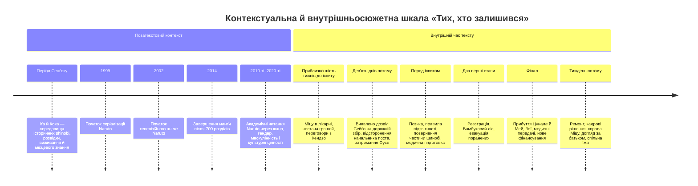
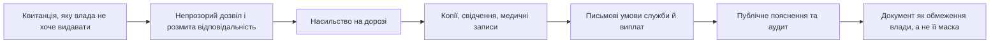

# «Ті, хто залишився»: етика інституцій після героїчного сюжету — розгорнуте інтертекстуальне прочитання

## Виконавче резюме

«Ті, хто залишився» — дев’ятичастинний трансформативний текст у світі *Naruto*, але його головна операція полягає не в продовженні канонічної пригоди, а в **радикальній зміні масштабу уваги**. Там, де канонічний *Naruto* тяжіє до випробування героя, бою, особистої сили, рангу, місії та видовищного зіткнення, цей текст ставить інше запитання: **хто шиє чохли, платить медикам, охороняє свідка, перевіряє кошториси, ремонтує лікарню, залишається з хворим батьком, повертає борги й відповідає за наслідки наказу після того, як героїчна подія закінчилася?** Саме тому найточніше жанрове означення твору — **інституційний реалізм усередині шьонен-всесвіту**, або навіть «роман про соціальне відтворення», замаскований під політико-адміністративний фанфік. fileciteturn0file0

Моя центральна теза така: **Сейґо проходить не шлях до більшої влади, а шлях до меншої центральності**. На початку він є людським «вузьким місцем» системи: всі рішення, нестачі й конфлікти мають пройти через нього. Він думає, що відповідальність означає відповісти на все самому. До фіналу текст поступово вчить його іншої політичної граматики: Масумі має вирішувати медичне; Ена — називати фінансову реальність; Джін — вести слідство; Кайо — захищати Академію; Рейка — керувати інформацією; сестра — не бути ще однією «відомістю» на його столі. Сейґо дорослішає політично тоді, коли перестає бути єдиним суб’єктом рішення і погоджується на аудит, процесуальні обмеження, майбутній перегляд власного призначення та конкретну частку сімейної доглядової праці. fileciteturn0file0

Другий ключовий висновок стосується **паперу**. Текст не є просто антибюрократичною сатирою. Квитанція спочатку стає приводом для насильства: Міцу каже лише «Я попросила квитанцію» — і ця буденна вимога робить її небезпечною для людей, влада яких тримається на непрозорості. Але надалі саме документи — письмові умови служби, медичні записи, платіжні календарі, копії дозволів, оголошення про скасування зборів, протоколи передачі поранених, відкриті матеріали майбутнього перегляду — стають механізмами обмеження сваволі. Отже, опозиція тут не «людина проти бюрократії», а **непідзвітний документ проти підзвітного документа**. fileciteturn0file0 Це особливо продуктивно читати поруч із Девідом Ґребером: бюрократія може утворювати «мертві зони» інтерпретації й структурного насильства, але дослідники адміністративної практики водночас наголошують, що професійна, етично обмежена служба може мати позитивну функцію. citeturn11search0

Третя теза: **іспит на чуніна навмисно перестає бути справжнім центром сюжету**. Канонічний *Naruto* робить Chūnin Exams одним із великих випробувальних і видовищних блоків; офіційні видання прямо акцентують індивідуальні бої та фінальну арену. citeturn9search0turn14search4turn14search6 У «Тих, хто залишився» бій важливий, але етична вага лежить у ширині дверей для нош, чергуванні медиків, оплаті праці, маршруті евакуації й тому, чи не перекрито лікарняний провулок торговими лавами. Героїзм переходить із «перемогти супротивника» до **зробити так, щоб пораненого можна було пронести через двері**. fileciteturn0file0

Четвертий висновок — феміністський. У дослідженнях *Naruto* Валері Гарві описувала жінок канону як сильних, але часто структурно спрямованих на підтримку чоловічих центральних персонажів. citeturn13search1turn13search4 «Ті, хто залишився» помітно **переписує цей розподіл авторитету**. Масумі не «допомагає Сейґо» — вона ставить йому межі. Ена не обслуговує його політичне бачення — вона не дає цифрам брехати. Рейка, Кайо, Міцу, сестра, Мей і Цунаде щоразу змушують його побачити ту частину реальності, яку його позиція схильна абстрагувати. Водночас текст не ідеалізує жіночу турботу: найбільший обсяг неоплачуваної доглядової праці все одно падає на сестру й матір, і лише фінальна обіцянка Сейґо взяти вечір із батьком починає цей розподіл змінювати. Це добре узгоджується з феміністською етикою турботи, яка підкреслює, що буденна доглядова праця часто низько оцінюється, погано оплачується і гендерно розподіляється. citeturn11search16turn11search1

Нарешті, назва «Ті, хто залишився» має щонайменше п’ять одночасних референтів: шинобі, які залишилися чи повернулися до Куси; цивільні, що не можуть просто піти від наслідків військової економіки; жінки й працівники, які підтримують повсякденне життя; батько, який фізично лишається поруч, хоча пам’ять починає відступати; і сам Сейґо, чия влада принципово тимчасова. Ще ширше — це **все те, що залишається після «великої події»**: рахунки, травми, брудні проходи, борги, уламки чашки, тканина зі спаленого воза, сімейні миски, невиконані обіцянки. fileciteturn0file0

## Контекст, жанровий статус і метод читання

Біографічного чи видавничого авторського контексту в наданому файлі немає, тому приписувати авторові конкретний фах, біографію, політичну позицію або свідомі літературні впливи було б некоректно. Можна говорити тільки про **імпліцитний авторський горизонт**, який реконструюється з самого письма: систематичний інтерес до державного управління, закупівель, трудових відносин, медичної логістики, делегування повноважень, доказової процедури, боргів та неформальної доглядової праці. Це характеристика поетики, а не біографічний висновок. fileciteturn0file0

Водночас жанровий контекст достатньо прозорий. Імена Цунаде, Мей Теруми, Канкуро, терміни Хокаґе, Мідзукаґе, генін, чунін, джонін, Кусаґакуре, система прихованих селищ, протектори, чакра, кучійосе та сама структура іспиту вказують на світ *Naruto*. Офіційна історія франшизи фіксує початок манґи Масаші Кішімото 1999 року, телеверсії — 2002-го, а завершення манґи 2014 року після 700 розділів; глобальний наклад перевищив 250 млн примірників. citeturn16search0 Канонічний іспит на чуніна справді функціонує як багатоетапна система селекції, що переходить до індивідуальних сутичок; офіційний сайт прямо описує перехід від командної роботи до індивідуальних боїв, а VIZ подає фінал іспиту як центральне аренне видовище. citeturn14search6turn9search0

У теорії фанфіку така практика найкраще розуміється не як «копіювання», а як **трансформація системи значень**. Анна Вілсон пропонує читати трансформативні тексти через три взаємопов’язані осі — привласнення матеріалу, перетворення та афект; Іка Вілліс особливо наголошує, що фанфік може втручатися не лише в сюжет першоджерела, а й у соціальний світ його розповідання. citeturn10search0turn10search1 Це надзвичайно точна рамка для «Тих, хто залишився»: текст не сперечається з каноном за допомогою альтернативного результату відомого бою. Він змінює **питання, які світові дозволено ставити**.

Інтертекстуальність тут доцільно розуміти в бакhtінсько-крістевському сенсі: текст набуває значення в діалозі з попередніми висловлюваннями, поглинаючи й трансформуючи їх. Саме це відрізняє серйозне інтертекстуальне читання від пошуку «пасхалок». citeturn10search5turn10search7 «Ті, хто залишився» ведуть щонайменше чотири діалоги одночасно: з *Naruto* як шьонен-епосом; з літературою бюрократичного й інституційного насильства; з феміністською традицією етики турботи й соціального відтворення; з утопічною проблемою «піти чи залишитися».

Остання лінія особливо цікава через назву. **Це не доведене джерело впливу**, і без авторського свідчення його не можна подавати як навмисну алюзію. Проте для читача «Ті, хто залишився» природно утворює назовий резонанс із «The Ones Who Walk Away from Omelas» Урсули Ле Ґуїн — оповіданням 1973 року про процвітання, залежне від страждання дитини, — та «The Ones Who Stay and Fight» Н. К. Джемісін. Офіційний сайт Ле Ґуїн датував «Omelas» 1973 роком і відзначає його Hugo 1974 року, а академічне дослідження Марка Табона прямо характеризує оповідання Джемісін як відповідь і переосмислення Ле Ґуїн. citeturn9search3turn17search2 Сам текст Джемісін був уперше опублікований 2018 року й пізніше передрукований у *Lightspeed*. citeturn9search8

Різниця принципова. Ле Ґуїн ставить питання про ціну моральної чистоти й виходу. Джемісін — про необхідність залишатися й активно протистояти несправедливості. «Ті, хто залишився» формулюють третю, набагато менш ефектну версію: **що означає залишатися, коли боротьба — це не один жест опору, а роки платежів, догляду, процедур, ремонту, компромісів і відповідальності за власну помилку?** fileciteturn0file0

Історичний shinobi-контекст теж створює цікавий контрапункт. Офіційні японські культурно-туристичні проєкти, присвячені Іґа й Кока, прямо застерігають, що глобальний образ «ніндзя» значною мірою сформований художньою культурою; історичні shinobi були пов’язані не лише з боєм, а й із розвідкою, виживанням, місцевою автономією та практичним знанням. citeturn15search0turn15search3 Державний туристичний опис музею медицини Кока фіксує традицію використання лікарських рослин та згадує *Bansenshukai* 1676 року з описами засобів для виживання під час місій. citeturn15search1turn15search10 Тому парадоксально саме «несенсаційні» медичні й логістичні деталі «Тих, хто залишився» повертають шинобі до історичнішої логіки виживання й інформації, хоча сам твір, безумовно, лишається в фантастичній системі *Naruto*.

Контекст можна звести до такої шкали:

## Поетика влади: папір, проходи, тканина, руки й крісла

Найсильніша властивість прози — **послідовне переведення абстрактної політики в матеріальний предмет**. Влада тут майже ніколи не проголошується теоретично. Вона набуває форми квитанції, рукава з нашивкою, підпису, дверей, стільця, миски, бинта, шматка тканини, замка, вузького проходу.

Початкова сцена задає всю етику твору. Міцу не хоче знімати плащ, тримає його біля живота, бо в ньому буквально зібрані її тілесна рана, майновий збиток і страх перед людьми, які претендують на право називати себе владою. Найважливіший її рядок надзвичайно короткий:

> «Я попросила квитанцію». fileciteturn0file0

Саме цей рядок перевертає стосунок документа й насильства. Вона не чинить озброєного спротиву. Вона вимагає, щоб збір став **пояснюваним**. Насильство виникає в мить, коли підлеглий просить владу створити слід власної дії.

Звідси й наступне її запитання:

> «Ваш Джін? … Той, у кого я маю поскаржитися на ваших?» fileciteturn0file0

Це майже ідеальна формула проблеми державної підзвітності: скаргу на систему треба подавати самій системі. З позиції Ґреберової критики бюрократії маємо ситуацію нерівного «інтерпретаційного труда»: Міцу мусить з’ясувати, хто справжній службовець, який збір законний, що вона має довести й кому може довіряти, тоді як озброєним людям досить заявити власну версію ситуації. Саме такі асиметрії аналізуються в дослідженнях бюрократії та структурного насильства. citeturn11search0

Але текст негайно ускладнює цю антибюрократичну модель. Масумі не каже «заберіть охорону, бо влада небезпечна». Вона проектує **правильну процедуру охорони**: черговий має стояти назовні; пацієнтка повинна бачити, що він не увійде без дозволу; доступ визначає медична логіка, а не вертикаль командування. fileciteturn0file0 Тобто проти поганої інституції виступає не відсутність інституції, а інституція, чия влада розщеплена між компетенціями.

Це повторюється десятки разів. Кендзо не вірить усній обіцянці повернення на службу — йому потрібні письмові умови. Ена змушує записати дату виплати. Рюдзі вимагає наперед визначити строк перегляду повноважень Сейґо. Іноземні делегації отримують пояснення щодо дороги. Медики ведуть записи передачі поранених. У фіналі ранг чуніна не визначається місцем у видовищному турнірі — Сейґо наполягає на сукупності матеріалів усіх етапів. fileciteturn0file0

Отже, моральна еволюція паперу виглядає так:

Особливо важливий поворот настає, коли Джін приносить дозвіл на дорожній збір. Підпис — Сейґо. Система виявляється не «зіпсованою десь унизу», а такою, що **розвинула насильницьку логіку з його власного рішення**. fileciteturn0file0 Кендзо доводить це до моральної жорстокості:

> «Ти підписав. Тут твоя печать висить біля дороги. Може, вас теж до того огляне медик?» fileciteturn0file0

Це, на мою думку, центральне речення всього твору. Воно руйнує найзручнішу для реформатора фантазію: ніби добрий керівник лише очищає систему від чужих зловживань. Ні — добрий намір може створити нормативну рамку, яку інші розтягнуть до насильства. Етичне управління тому визначається не відсутністю помилок, а **здатністю впізнати власний підпис у чужій рані**.

Другий великий мотив — **прохід**. Уже в лікарні хлопець із мискою прибирає її з дороги, хоча Сейґо проходить біля іншої стіни. У цій мікродеталі закодована ієрархія: нижчий заздалегідь звільняє простір сильнішому. fileciteturn0file0 Далі весь сюжет одержимо перевіряє, хто кому має дати пройти. Дорогу перекриває незаконний збір. Міцу в коридорі стає до стіни, коли повз ідуть озброєні. У Бамбуковому лісі перегородка заважає двом носіям пронести ноші. Під час свята торгові лави перекривають лікарняний провулок. На арені Сейґо у вступній промові просить глядачів «залишати проходи вільними». fileciteturn0file0

Тут міститься майже повна політична філософія тексту: **справедлива влада — та, що робить прохід можливим**. Не та, що рухається першою, а та, що знімає перепону для пораненого, торговки, учня, працівника, свідка. Не випадково одна з найбільш показових адміністративних перемог твору полягає буквально у демонтажі перегородки.

Третій мотив — **тканина і шиття**. Міцу везе фарбовану тканину; її товар горить разом із возом. Сестрина майстерня шиє чохли для великого іспиту. Батько, чия пам’ять уже порушена, все ще здатний пальцями відчути, що край тканини треба завернути вдруге. На арені Сейґо впізнає саме цю роботу. Наприкінці врятовані шматки Міцу потенційно переходять у майстерню сестри: їй потрібні не благодійність і не героїчне спасіння, а стіл та ножиці. fileciteturn0file0

Тканина робить видимим те, що марксистська та феміністська теорії називають матеріальним і соціальним відтворенням: військово-державне видовище можливе тому, що хтось шиє, миє, годує, лікує, ремонтує й доглядає. Фрейзерова рамка особливо доречна: репродуктивна праця часто залишається невидимою, хоча є необхідною умовою «продуктивної» економіки. citeturn11search1turn11search4 У «Тих, хто залишився» видовище іспиту буквально лежить на чохлах, за які вчасно не заплатили.

Шиття водночас є композиційною метафорою твору. Автор не «заліковує» розриви великим фінальним рішенням. Він **зшиває краї**: часткову компенсацію; тимчасове житло; новий графік; не весь загін, а чотирьох людей; не вилікуваного батька, а один конкретний вечір догляду; не абсолютну справедливість для Міцу, а стіл, ножиці й можливість знову заробляти. Це естетика ремонту замість естетики спасіння.

Четвертий мотив — **руки**. Міцу стискає плащ біля рани. Медсестра розрізає шов. Сейґо постійно тримає руки, щоб не вдарити ними — а потім б’є шафу, дверцята, стілець, штовхає чай. Ґенджі кладе руку на передпліччя начальника поста. Мей торкається рукава Сейґо. Сестра тримає його папір, змушуючи нарешті подивитися на неї, і забирає руку, коли він кричить. Наприкінці Сейґо бере від неї миску. fileciteturn0file0 Рука в тексті може бити, оформлювати, лікувати, шити, зупиняти, торкатися й годувати. Інакше кажучи, **влада й турбота мають той самий орган**.

Мотив крісла завершує цю систему. Сейґо приватно штовхає стілець у стіну; слід доводиться замазувати. Рюдзі ставить питання, на якій підставі Сейґо продовжує «сидіти» у своїй посаді. На фіналі він буквально опиняється в розділі «Між двома кріслами», між Цунаде й Мей, під поглядом даймьо, старших шинобі, суперника Морі й міжнародних делегацій. fileciteturn0file0 А вже після фіналу до кімнати генінів доводиться **принести додаткові стільці**. Символ влади перестає бути одним особливим кріслом і стає питанням того, чи вистачає місця іншим.

Стилістично це підтримується близькою третьоособовою фокалізацією через Сейґо та елементами невласне-прямої мови. Ми майже ніколи не отримуємо великого авторського діагнозу героя. Його стан видають синтаксис, повтори, тілесні рухи й предмети: завчене «Я вас почув»; повторюване «Я знаю»; дверцята шафи; розбита чашка; стілець; пакет чаю; різке вставання. fileciteturn0file0 Це проза **ретельно стриманого афекту**: чим формальнішим мусить бути герой серед людей, тим голосніше його тіло говорить у порожній кімнаті.

Назви частин теж працюють подвійно. «Без відстрочки» означає і платіжний строк, і моральну неможливість далі відкладати відповідальність. «Пост» — і дорожній пост, і позицію влади. «До початку» та «Два дні» стискають час до дедлайну. «Найкращий сорт» перетворює дипломатичний чай на сцену нервового краху. «Між двома кріслами» матеріалізує політичне становище Сейґо. «Тиждень потому» свідомо відсуває кульмінацію: **справжній тест починається після фіналу**, коли треба жити з його наслідками. fileciteturn0file0

## Критичні оптики: феміністська, марксистська, постколоніальна, психоаналітична й екокритична

Порівняння теоретичних рамок показує, що текст навмисно опирається одномірному прочитанню:

| Критик / рамка | Основна ідея | Що вона відкриває у «Тих, хто залишився» | Де її межа |
|---|---|---|---|
| Бахтін / Крістева, інтертекстуальність | Значення тексту виникає в діалозі та трансформації інших дискурсів. citeturn10search5turn10search7 | *Naruto* не просто цитується: його бойова й рангова система переакцентується як історія інституцій, праці та відповідальності. | Не пояснює сама по собі, чому саме економіка догляду стає новим центром. |
| Анна Вілсон / Іка Вілліс, fan studies | Фанфік працює через трансформацію, афект і втручання у політику оповіді. citeturn10search0turn10search1 | Пояснює, чому периферійні питання канону — зарплата, медицина, цивільні, аудит — можуть стати повноцінним сюжетом. | Не варто автоматично вважати будь-яку трансформацію «опозиційною» до канону. |
| Валері Гарві, гендер у *Naruto* | Жінки в каноні можуть бути сильними, але часто підтримують чоловічих центральних героїв. citeturn13search1turn13search4 | Тут Масумі, Ена, Кайо, Рейка, Міцу, сестра, Мей і Цунаде одержують автономну професійну владу та обмежують Сейґо. | Вони все одно існують у тексті з чоловічим головним фокалізатором. |
| Ґребер / дослідження бюрократичного насильства | Непрозора адміністративна структура перекладає інтерпретаційну працю на слабшого й може підтримувати структурне насильство. citeturn11search0 | Квитанція, дорожній пост, нечіткий дозвіл, потреба Міцу доводити власну травму. | Текст не антибюрократичний: правильні процедури тут також рятують. |
| Ненсі Фрейзер / соціальне відтворення | Виробнича система залежить від часто невидимої доглядової й репродуктивної праці. citeturn11search1turn11search13 | Іспит існує завдяки швачкам, їжі, медикам, родині, дорогам, навчанню — тобто праці, яку героїчна оптика зазвичай не бачить. | Куса не є прямою моделлю сучасного капіталізму, тож це аналогія, а не буквальна економічна тотожність. |
| Яель Берда, режим дозволів і мобільності | Дозволи, класифікації та контроль руху можуть не просто реалізувати політику, а виробляти політичні категорії й нерівність. citeturn11search3turn11search9 | Пост визначає, кому й за яку ціну дозволено рухатися; дорога стає інструментом влади над цивільним життям. | У творі немає достатніх підстав називати Кусу буквальним колоніальним режимом. |
| Феміністська етика турботи | Буденна турбота гендерована, низько статусна й часто невидима поруч із «героїчним» втручанням. citeturn11search16 | Масумі, сестра, мати, швачки й Міцу показують інфраструктуру життя за військовою системою. | Саме поняття «жіночої турботи» треба застосовувати обережно, щоб знову не замкнути жінок у цій функції. |

**Феміністське прочитання** особливо сильне у сцені з сестрою. Вона буквально зупиняє його роботу рукою і каже:

> «Тоді подивися на мене. Я не відомість тобі принесла». fileciteturn0file0

Це не лише сімейний докір. Це формула всього роману: **людина не є відомістю**. Сейґо чинить правильно, коли створює добрі відомості, але неправильно, коли його мислення починає бачити у світі тільки їх. Сестра вимагає не скасування його службової відповідальності, а визнання того, що догляд за батьком — така сама реальна інфраструктура, як дорога чи лікарня. Феміністська біоетика саме так критикує тенденцію вважати домашній догляд природним і майже безкоштовним ресурсом, особливо коли його мовчки покладають на жінок. citeturn11search16

У цьому сенсі фінальне:

> «У вівторок можу прийти після сьомої… До батька». fileciteturn0file0

важливіше за додаткове фінансування даймьо. Гроші збільшують спроможність держави; названа дата змінює **розподіл відповідальності**. Раніше Сейґо дає людям майбутнє у формі «подивимося після іспиту». Тепер він називає конкретний час.

**Марксистська оптика** робить видимою специфічну економіку Куси. Шинобі — не романтизовані воїни, а працівники, які залишають службу, коли їм не платять. Село позичає під майбутні місійні надходження. Старі борги оплачуються новим доходом. Працівники майстерні кредитують державу власною неоплаченою працею. Наймані групи й державні сили конкурують за тих самих кваліфікованих людей. Іспит водночас є військовою селекцією, дипломатичним заходом і локальним економічним стимулом — постіль, їжа, кімнати, торгові місця, перевезення. fileciteturn0file0

Саме тому фраза Кендзо про те, що від іспиту спершу зароблять ті, «хто шиє постіль», має подвійне лезо. Він вимовляє її як цинічне знецінення політичного проекту Сейґо, але текст доводить протилежне: **так, вони теж мають заробити — і це не побічний ефект, а частина того, для чого існує політична економія**. fileciteturn0file0

При цьому твір уникає простого антикапіталістичного мораліте. Приватний підряд може бути небезпечним, але Кендзо володіє компетенціями, яких бракує селищу. Купці кредитують Кусу, але вимагають прозорості. Спільні супроводи з Хайґакуре вирішують реальну нестачу людей. Текст не пропонує «ліквідувати ринок» або «приватизувати все»; він запитує, **якими процедурами зробити взаємозалежність нехижацькою**. fileciteturn0file0

**Постколоніальна оптика** корисна, якщо застосовувати її як аналогію, а не як твердження про буквальний колоніальний статус Куси. Куса в тексті є меншою політичною одиницею, яка мусить доводити свою спроможність великим зовнішнім гравцям, залежить від місійних доходів, позик і уваги даймьо, боїться репутаційного провалу перед міжнародними делегаціями. Одночасно вона контролює власних периферійних мешканців через пост, збір і озброєну мобільність. fileciteturn0file0 Дослідження Яель Берди показують, наскільки режими дозволів, реєстрації й контролю руху можуть самі конструювати категорії підозрілих і керованих тіл. citeturn11search3turn11search9

Тому Куса займає цікаву подвійну позицію: **периферія щодо великих центрів і центр щодо власної дороги**. Сейґо може почуватися приниженим перед Цунаде, Мей або зовнішніми кредиторами — але для Міцу саме його ім’я висить унизу дозволу. Така зміна масштабу позбавляє периферійність моральної невинності.

**Психоаналітична оптика** найкраще працює не як клінічний діагноз Сейґо, а як аналіз розподілу афекту. У публічній сфері він дисциплінує себе до мовних формул: «Я вас почув», «Я знаю», «передамо», «погодимо». На самоті афект переходить у предмети: чашка, шафа, стілець, чай. fileciteturn0file0 Його агресія дивним чином посилюється саме тоді, коли зовнішній співрозмовник не дає йому ясної проблеми, яку можна «вирішити». Через це сцена з Ясуші така важлива. Ясуші говорить дипломатично, не формулює прихованого ультиматуму — а Сейґо не може витримати неоднозначності й штовхає пакет чаю на підлогу. fileciteturn0file0

Це показує його глибинну фантазію контролю: якщо всі потреби будуть чітко сформульовані, він зможе їх задовольнити або відхилити. Але дорослий політичний світ не дає такого комфорту. Люди суперечливі, ресурси обмежені, причини не завжди відомі, наслідки не завершуються в межах наказу. Дозрівання героя тому можна прочитати як **відмову від омніпотентної фантазії «я маю все втримати»**. Найточніша корекція приходить від Мей:

> «Ви весь час дивитеся, куди нам іти, а я тут». fileciteturn0file0

Це і романтична репліка, і психічний діагноз без діагностування: Сейґо весь час живе в наступному пункті маршруту.

**Екокритична рамка** тут найслабша, але не нульова. Природа майже ніколи не романтизована: стара переправа, західна дорога, Бамбуковий ліс, мокрі сходи, вода у стіні лікарні, маршрути тварин і возів — усе постає як **інфраструктурна екологія**, середовище, через яке мусять рухатися тіла. fileciteturn0file0 Історичний контекст Іґа й Кока теж пов’язує shinobi з конкретною топографією, горами, лісами та знанням лікарських рослин. citeturn15search3turn15search1 Але твір значно більше цікавиться соціальним ремонтом, ніж автономною цінністю не-людської природи, тому екокритика тут радше допоміжна.

## Ключові сцени, міжрядкові смисли й альтернативні прочитання

**Сцена Міцу в лікарні** встановлює головну моральну проблему: чи може людина бути захищена системою, на яку вона водночас скаржиться? Те, що вона не хоче знімати плащ, — більше ніж сором або страх огляду. Плащ є останньою оболонкою контролю над власним тілом. Масумі фактично повертає їй суверенність над простором лікування: охорона не входить без дозволу; лікар має пріоритет; свідчення відкладають. fileciteturn0file0 Це феміністсько-медична модель влади, в якій безпека не означає збільшення кількості озброєних людей у кімнаті.

Альтернативне прочитання тут менш оптимістичне: Куса пропонує Міцу захист саме тому, що її вже зробила вразливою власна система. Тобто кожен добрий жест Сейґо частково є **ремонтом шкоди, виробленої його владою**. Його гуманність не скасовує асиметрії.

**Сцена з незавершеним запитом на перевірку Морі** є одним із найважливіших доказів того, що текст не романтизує Сейґо. Після політичної суперечки він хоче використати Джіна, щоб перевірити фінанси конкурента. Формально пристойну підставу можна було б вигадати. Але він не здатен написати речення, яке не видає помсту, — і рве аркуш. fileciteturn0file0 Це малий етичний тріумф: не «герой не має авторитарних імпульсів», а **герой має їх і не завжди їм кориться**.

Та й тут можливе суворіше прочитання: те, що Сейґо зупинився один раз, не гарантує структурного захисту від наступного очільника. Саме тому пізніший аудит і формалізований перегляд посади важливіші за особисту порядність.

**Сцена на дорожньому посту** перевертає логіку провини. Начальник поста має реальне виправдання: просив коштів, отримав відмову, йому сказали «шукати на місці». Він справді захищає дорогу від нападників. Тому його аргумент «ви тепер говорите про все разом» не цілком хибний. fileciteturn0file0 Текст відмовляється дати читачеві комфортного лиходія. Насильницька система могла виникнути з сукупності частково раціональних рішень: недофінансований пост → місцеве самофінансування → приватні працівники → розмиті повноваження → плата за рух → насильство над тим, хто питає про квитанцію.

Це й робить твір справжнім інституційним романом: зло тут часто не має єдиного автора.

**Фусе** ще сильніше ускладнює питання. У ньому легко побачити винного нападника, але Кендзо наполягає на процесі, медичному огляді, відсутності нічного зникнення, можливості свідчити на його користь. Сейґо відмовляється залишити підозрюваного у Кендзо, але погоджується на медичні гарантії й формальне затримання. fileciteturn0file0 Сцена важлива тим, що права не видаються лише симпатичним жертвам. Якщо процедура захищає тільки Міцу, але не Фусе, це не процедура, а табірна лояльність.

**Ясуші й чай** — майже комічна сцена дипломатичної катастрофи, але її міжрядковий сенс серйозний. Сейґо вважає непрямість формою маніпуляції. Ясуші, навпаки, демонструє, що не кожна недомовленість є пасткою. Коли після спалаху Сейґо пакет «найкращого сорту» падає на підлогу, Ясуші просто п’є чай і підтверджує, що він смачний. fileciteturn0file0 Це сцена **відмови другого персонажа прийняти роль ворога**, яку йому пропонує емоційний стан протагоніста.

Можливе політичне прочитання суворіше: спокій Ясуші також є привілеєм сильнішого чи принаймні менш перевантаженого переговорника. Він може дозволити собі неквапність, тоді як у Сейґо строки, борги й дефіцит людей. Тому сцена не просто «Сейґо поводиться погано»; це ще й зіткнення **нерівних часових режимів влади**.

**Приїзд Мей** змінює тон не тому, що починається романтика, а тому, що вона постійно переводить його з майбутнього часу в теперішній. Вона бачить нестачу навчальних наборів, брак викладачів, лікарню, резиденцію, площу, але не перетворює все це на інспекцію. fileciteturn0file0 Її дотик до рукава й репліка про те, що вона «тут», протистоять звичці Сейґо дивитися на людину як на наступний дипломатичний пункт.

Романтичне прочитання можливе, але не вичерпне. Функціонально Мей виконує те саме, що сестра і Масумі: **повертає його увагу до присутнього тіла**, яке адміністративна свідомість схильна перетворювати на задачу.

**Фінал іспиту** — найвиразніша деконструкція канонічного видовища. В оригінальній франшизі третій етап іспиту справді пов’язаний з індивідуальними поєдинками та ареною; офіційні описи канону й пізніших іспитів це прямо підтверджують. citeturn14search4turn14search2 У цьому тексті бій збережений — навіть із вигуками назв технік і видовищними призовами, — проте фокалізація постійно вислизає з нього: хто виносить пораненого, чи звільнив Ґенджі прохід, кому передали медичні відомості, чи є прямий зв’язок із Шізуне, чи токсикологічний огляд уже розпочато. fileciteturn0file0

Цунаде тут особливо вдалий канонічний інтертекст: офіційний профіль описує її не тільки як П’яту Хокаґе, а як медичну ніндзя, яка наполягала на системі бойової медицини й навчанні медиків та після приходу до влади займалася відновленням селища, медициною й дипломатією. citeturn9search1 Тому її запитання «що вони зараз роблять?» розкриває межу Сейґо: він організував систему, але все ще інстинктивно хоче **знати все сам**, хоча насправді його обов’язок — забезпечити компетентного медика й канал зв’язку.

Так само поява Мей не випадкова в символічному плані: канон офіційно закріплює її як Мідзукаґе, одну з П’яти Каґе. citeturn9search13 Сейґо буквально сидить між двома очільницями великих систем. Однак фінальна сцена не підтверджує його меншість — вона перевіряє, чи здатен він перестати компенсувати цю меншість тотальним контролем.

**Післяфінальна частина** принципово відмовляє читачеві в катарсисі. Фусе не виправдано й не засуджено остаточно. Другого перевізника не знайдено. Міцу не отримала все відшкодування. Батько не одужав. Частина людей Кендзо пішла. Ремонт ще треба спроектувати. Політичний перегляд Сейґо попереду. fileciteturn0file0

Це не «незакриті сюжетні лінії» в слабкому сенсі — це етична теза. **Інституційна справедливість майже ніколи не має фінального кадру.** Її форма — наступний понеділок.

## Синтез: що означає «залишитися»

Найсильніше прочитання назви виникає, коли відмовитися шукати одну групу «тих, хто залишився».

Залишився Кендзо — але не весь його загін. Лишилися четверо тих, кого він повертав, і тепер вони вже не ходять усі разом. Лишилися люди на дорозі, хоча їхня система змінилася. Лишилася Міцу, бо додому поки небезпечно й економічно невигідно повертатися. Лишилася сестра в майстерні, коли Сейґо міг поїхати в канцелярію. Лишилася мати біля батька. Лишився батько — але частина його пам’яті вже йде. Лишився Сейґо на посаді — але тільки до формалізованого перегляду. fileciteturn0file0

Ще точніше: **залишаються наслідки**.

Після незаконного збору залишається підпис.  
Після розбитої чашки — уламки.  
Після удару стільця — слід на стіні.  
Після пожежі — шматки тканини.  
Після іспиту — поранені, борги, нові місії та ремонт.  
Після сварки із сестрою — потреба назвати конкретний вечір. fileciteturn0file0

Через це структура тексту є антигероїчною не тому, що в ній немає героїзму, а тому, що вона **перевизначає його одиницю виміру**. Дослідження наративної структури *Naruto* підкреслює його змішання епічної, пригодницької, шьоненової та інших жанрових моделей. citeturn12search4 Дослідження маскулінності в *Naruto* також пов’язує позитивного чоловічого героя з боротьбою за інших. citeturn12search0 «Ті, хто залишився» не заперечують цю етику «за інших» — вони її **десенсаціоналізують**. Боротися за інших може означати не ризикнути життям один раз, а вчасно оплатити швачці рахунок.

Саме тому я запропонував би визначити текст як **постгероїчну етику обслуговування спільного світу**.

Це не етика самопожертви. Текст не винагороджує Сейґо за те, що той виснажився сильніше за всіх. Навпаки, його виснаження стає суспільною загрозою: воно штовхає його до помсти Морі, до спалаху проти Ясуші, до крику на сестру, до речей, які він б’є на самоті. fileciteturn0file0 Політична зрілість полягає не в тому, щоб героїчно витримувати ще більше, а в тому, щоб **розподіляти компетенцію й тягар**.

Тому роль жіночих персонажів настільки структурно важлива. Масумі каже: не забирай другого медика. Ена каже: грошей на всіх у строк немає. Кайо каже: попросиш Ену ти, я вже просила. Рейка показує, що іноземні делегації бачать проблему й без офіційної доповіді. Сестра каже: подивися на мене. Мей каже: я тут. Цунаде фактично каже: не розповідай мені систему — скажи, що відбувається з пацієнтом зараз. fileciteturn0file0

Це не хор помічниць героя. Це **мережа корекції чоловічої центральності**.

Саме тут твір найцікавіше сперечається з гендерною організацією канону, описаною Гарві: якщо в *Naruto* сильна жінка нерідко лишається структурно підтримувальною стосовно чоловічої героїчної траєкторії, то тут підтримувальна робота сама стає джерелом політичного авторитету — а чоловічий протагоніст мусить навчитися підпорядковуватися професійним межам жінок навколо нього. citeturn13search1

Водночас це не чиста феміністська утопія. Сестра все ще мусить вимагати, щоб брат нарешті взяв частину догляду за батьком. Мати залишається невидимою значну частину сюжету. Міцу мусить фактично відбудовувати засоби до існування після насильства, спричиненого владою. fileciteturn0file0 Саме ця незавершеність робить текст переконливішим: він показує не «правильну систему», а **процес перерозподілу того, що раніше вважалося безкоштовним і самоочевидним**.

Так само неоднозначно слід оцінювати політичну траєкторію Сейґо. Оптимістичне прочитання бачить у ньому реформатора, який приймає провину, скасовує збір, дозволяє цивільний розгляд, не переслідує Морі, погоджується на аудит і готується до перегляду власного мандата. fileciteturn0file0 Суворіше прочитання відповідає: майже кожна з цих реформ відбувається **після того, як хтось інший примушує його побачити межу власної влади**.

На мою думку, друге не скасовує першого — саме воно робить перше цінним. Демократична чеснота тут не полягає в тому, щоб завжди самому знати правильну відповідь. Вона полягає у здатності **не знищити людей, які кажуть тобі, що ти помиляєшся**.

Через це особливо вдалий контраст із класичним героїчним сюжетом. Герой пригодницького типу часто доводить моральну правоту перемогою. Сейґо ж підтверджує право залишатися на посаді тим, що погоджується на процедуру, яка потенційно може цю посаду в нього забрати. fileciteturn0file0

І тут назовий резонанс із Ле Ґуїн і Джемісін стає найпродуктивнішим, навіть якщо він цілком неусвідомлений. В «Omelas» моральний жест — піти від системи, побудованої на чужій жертві. У Джемісін — залишитися й протидіяти несправедливості; академічна критика прямо описує її твір як відповідь Ле Ґуїн. citeturn17search2 У «Тих, хто залишився» є ще один крок: **залишитися означає погодитися, що ти не стоїш поза системою, яку лагодиш**.

Сейґо не може сказати: «це зробили вони».  
Його підпис уже на дозволі.  
Сестра вже шила неоплачені чохли.  
Міцу вже поранено.  
Батько вже хворіє.  
Фусе вже затриманий.  
Іспит уже запущений. fileciteturn0file0

Моральна дія починається не з чистої позиції, а **зсередини вже заподіяного**.

Тому фінальний образ — не тріумфальна арена, не гроші даймьо, не романтична сцена з Мей і навіть не політичне примирення з Морі. Це брат і сестра, які сидять за столом; він звільняє для неї стілець, вона ставить їжу, а перед тим він нарешті назвав вечір, коли перебере її зміну біля батька. fileciteturn0file0

На початку хлопець із перев’язаною ногою **прибирає свою миску, щоб не заважати Сейґо пройти**. Наприкінці Сейґо **прибирає свої папери, щоб поставити миску й посадити сестру**. fileciteturn0file0

Це, мабуть, найтонша дуга всього твору.

Вона показує, що справжня зміна героя відбулася не тоді, коли він провів міжнародний іспит, а тоді, коли навчився **сам звільняти місце**.

## Висновки та маршрут подальшого читання

«Ті, хто залишився» найкраще прочитуються як **контрфокалізація шьонен-всесвіту**. Текст не руйнує *Naruto*: він бере його серйозніше, ніж це робить звичайна пригодницька оптика. Якщо приховані селища справді є інституціями; якщо шинобі отримують ранги, зарплату, місії, лікування й накази; якщо існують Академія, лікарня, кордони, дипломатія та іспити — тоді неминуче мають існувати борги, закупівлі, трудові конфлікти, ремонти, цивільні жертви, підрядники, процедури скарги та люди, які ввечері миють миски. fileciteturn0file0 Канонічна франшиза справді дає цьому адміністративному розширенню матеріал: Хокаґе є керівником селища, Цунаде поєднує політичне керівництво з медичною інституціалізацією, а іспит на чуніна є формальним механізмом оцінки й ранжування. citeturn16search0turn9search1turn14search6

Оригінальність твору — в тому, що він не просто додає «реалізму». Він змінює **моральну онтологію важливого**. Ширина дверей може бути важливішою за техніку переможця. Квитанція — важливішою за протектор. Оплачений рахунок — важливішим за промову. День, названий сестрі, — важливішим за міжнародний дипломатичний успіх. fileciteturn0file0

Через це найпереконливіша теза для академічного есе могла б звучати так:

**«Ті, хто залишився» трансформують героїчну політику *Naruto* в етику інституційного ремонту: замість питання, хто достатньо сильний, щоб очолити селище, текст питає, чи здатен очільник створити таку систему, у якій люди можуть безпечно поскаржитися на нього, отримати оплату без особистої ласки, бути лікуваними незалежно від статусу, залишити службу за умовами контракту й змусити самого керівника звільнити місце для чужої потреби.** fileciteturn0file0

Звідси випливає й другий, ще радикальніший аргумент: у цьому творі **добре управління вимірюється зменшенням необхідності в Сейґо**. На початку всі дороги ведуть до його столу. Наприкінці Масумі лікує, Ена рахує, Кайо керує Академією, Рейка перевіряє інформацію, Джін веде справу, сестра домовляється з Міцу, комісія розглядає кандидатів, кредитори бачать платежі, а майбутні збори отримають матеріали про помилки самого Сейґо. fileciteturn0file0 Його політичний успіх полягає не в концентрації, а в **інституціалізації власної замінності**.

Для подальшого читання найпродуктивнішим буде не широкий список «про *Naruto* взагалі», а кілька текстів, кожен із яких освітлює окремий шар:

| Читання | Для чого читати поруч із «Тими, хто залишився» |
|---|---|
| Масаші Кішімото, канонічні томи арки Chūnin Exams | Щоб буквально зіставити, які елементи іспиту збережено, а які зміщено з героїчного бою до інституційної логістики. Офіційні матеріали підтверджують центральність командних випробувань, індивідуальних боїв та фінальної арени. citeturn9search10turn14search4turn14search6 |
| Валері Гарві, «La représentation des valeurs japonaises dans le manga Naruto» | Для зіставлення колективізму, зв’язків, лідерства й гендерної ролі жінок у каноні з їхнім переписуванням у цьому тексті. citeturn13search1turn13search2 |
| Danghelly Giovanna Zúñiga-Reyes, «Conjunción de géneros narrativos en Naruto» | Для розуміння *Naruto* як уже гібридної суміші епосу, шьонену, пригоди та інших наративних моделей, до якої «Ті, хто залишився» додають адміністративний реалізм. citeturn12search4 |
| Anna Wilson, «Fan fiction and premodern literature: Methods and definitions» та Ika Willis, «Amateur mythographies» | Для теоретичного опису фанфіку як трансформації, а не похідного наслідування, і для аналізу того, як трансформативний текст змінює політику оповіді. citeturn10search0turn10search1 |
| Nancy Fraser / література про кризу турботи та соціальне відтворення | Для поглиблення аналізу майстерні, медицини, сімейного догляду, навчання й неоплачуваної роботи як умов існування «героїчної» економіки. citeturn11search1turn11search13 |
| Yael Berda, *Colonial Bureaucracy and Contemporary Citizenship* | Для детальнішого прочитання поста, дозволу, дороги, контролю мобільності й того, як адміністративні процедури можуть самі продукувати категорії підозри. citeturn11search3turn11search9 |
| Ursula K. Le Guin, «The Ones Who Walk Away from Omelas» і N. K. Jemisin, «The Ones Who Stay and Fight» | Не як доведені джерела твору, а як сильний порівняльний інтертекст для етики виходу, залишання, співучасті та ремонту несправедливого світу. citeturn9search3turn17search2turn9search8 |

У підсумку текст досягає рідкісного ефекту: він робить **компетентність драматичною**. Носії тренуються пронести ноші до початку надзвичайної ситуації. Ена не погоджується рахувати гроші, яких немає. Масумі не віддає медика тільки тому, що керівникові так зручніше. Міцу хоче не символічного співчуття, а відшкодування, стола й ножиць. Сестра не просить Сейґо «більше любити сім’ю» — вона просить назвати день. fileciteturn0file0

Саме в цій конкретності — головна художня сила «Тих, хто залишився».

Бо твір зрештою питає не: **хто врятує селище?**

Він питає: **хто буде тут у вівторок після сьомої, коли врятоване селище все одно треба буде годувати, лікувати, ремонтувати й доглядати?** fileciteturn0file0